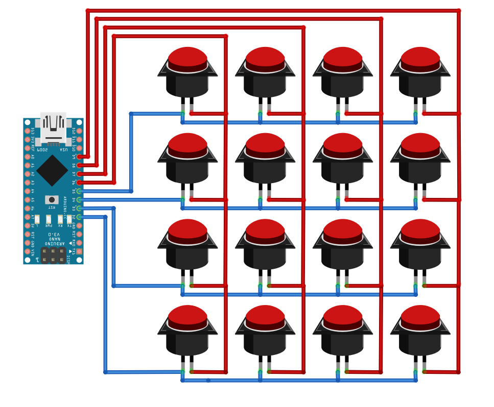

# Arduino Nano Button Box :construction:

WIP :construction: - This repository is still work in progress.

If you have Arduino Nano, and you want to build a button box, below is listed everything you need and how to do it.

# Software

- vJoy
- python
- Arduino IDE

# Python Script

For a computer to recognize button press from arduino nano we need to run this python script when we want to use the device aka Button Box.

# Arduino Code

This is the code that I used in my example, but feel free to modify to suit your needs.

# Wiring Diagram

